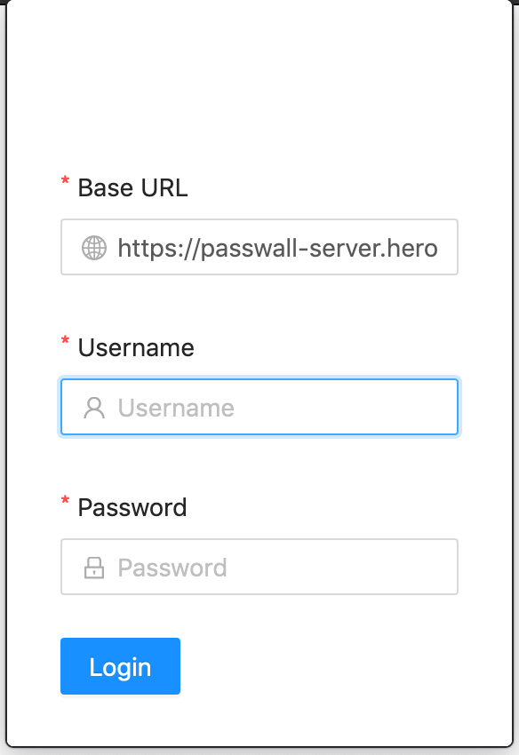
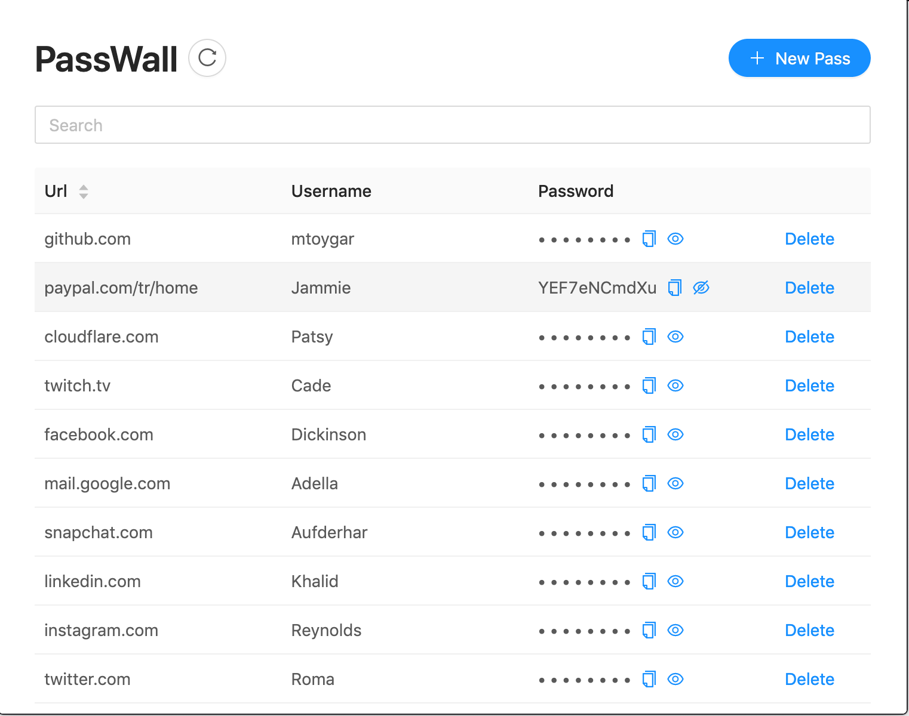
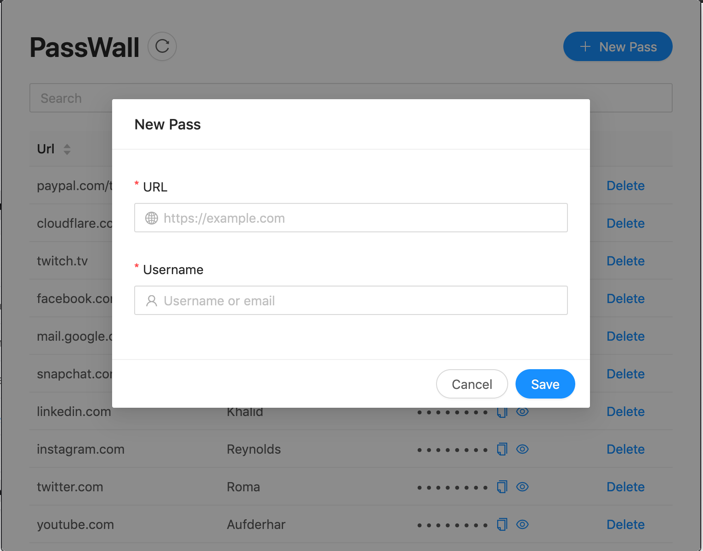
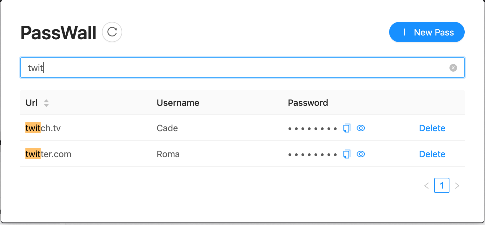

# PassWall Browser Extension

This repo is constituted to demonstrate the utilization of official [passwall-web](https://github.com/pass-wall/passwall-web/) code for a browser extension usage. By [static export](https://nextjs.org/docs/advanced-features/static-html-export) feature of next.js, the web code can be directly used on an extension.

Obviously, the web code does not designed for such a use, but most of the javascript code can be used directly or with little change. Moreover, having a framework eases the testability and maintainability of the extension code.

### Screenshots

- Below screenshots are actually identical to passwall-web. The only difference is they are taken from extension's popup.

<table>
  <tr>
    <td></td>
    <td></td>
  </tr>
  <tr>
    <td></td>
    <td></td>
  </tr>
</table>

### Development

1. Clone the project.
2. Run `npm build` to build the project.
3. Run `npm export` to generate static export. It will be exported to `out` folder in project's root directory.
4. Copy `out` folder to the `extension-src` folder which is on project's root directory.
5. Install the extension in the development mode directly to Firefox or Chrome. Below two links can guide you on how to do it.
- https://developer.chrome.com/extensions/getstarted#manifest
- https://developer.mozilla.org/en-US/docs/Mozilla/Add-ons/WebExtensions/Your_first_WebExtension
